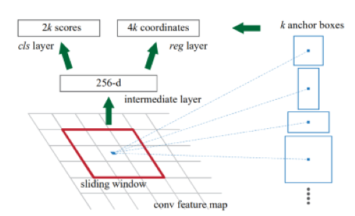

Faster R-CNN: Towards Real-Time Object Detection with Region Proposal Networks
==============================================================================
최근의 State-of-the-art object detection method에서 region proposals 알고리즘이 차지하는 비중은 크다. SPP-Net과 Fast R-CNN에 이어서 새로운 Region Proposal Network(RPN)이라는 새로운 region proposals method을 소개한다. RPN은 Fully Convolutional Network형태로 각각의 위치에서 objectness scores와 object bounds를 동시에 예측한다. RPN을 통해 어디를 중점적으로 봐야하는지 attention의 개념을 적용해 뒤의 network에게 알려줄 수 있다. 

## Introduction
R-CNN 이 Region based CNN인 것처럼 최근 Region proposal은 Object detection 분야에서 생각보다 중요하다. 기존의 selective search와 같은 region proposal 알고리즘도 휼륭한 성과를 거두었지만 느리다는 단점이 존재한다. 그리고 selective search가 CPU로 작동하기 때문에 속도가 매우 느리고 GPU로 작동할 수 있는 알고리즘이 필요하다. 이러한 배경으로 등장한 것이 RPN이다. 마찬가지로 convolutional layer를 공유함으로써, 즉 한번의 convolutional을 통해 계산시간을 많이 단축할 수 있게 되었다. 위에서 살펴보았듯이 FCN구조이기 때문에 End-to-End 방식으로 학습시키는 것이 가능하다. 

## Faster R-CNN
Faster R-CNN은 전체적으로 2가지 부분으로 나누어 진다. 첫 번째 모듈은 region proposal을 구하는 network, 두 번째 모듈는 이를 이용하는 Fast R-CNN detector이다. Faster R-CNN은 detection을 위한 single network로 여기서 RPN은 attention을 구하는 역할을 담당한다. 말그대로 뒤에 detector에게 "여기를 집중적으로 봐" 라고 하는 것과 같은 개념이다. 전체적인 그림은 다음과 같다. 

## Region Proposal Networks
먼저 입력으로 임의의 크기의 사진이 들어간다. 출력값으로는 boundbox coordinate 를 나타내는 정보가 나오고 각각의 objectness score 가 나온다.여기서 objectness란 다음과 같이 소개되어있다. 

> “Objectness” measures membership to a set of object classes vs background.

단순히 어떤 class의 객체 인지는 파악이 안되지만 그 bbox안에 객체가 있는지를 나타내는 값으로 이해하면 될 거 같다.

RPN은 궁극적으로 anchor의 가능성을 예측한다. 그리고 anchor를 재조정한다. 

## Anchor

입력 이미지에서 각각 3개의 서로 다른 scale과 aspect ratio를 이용해 만든 직사각형으로 어떤 물체도 감지할 수 있다는 사실이 실험으로 입증되었다. 

저자들은 RPN에 Anchor라는 새로운 개념을 도입했다. 입릭 이미지에 대하여 convolution을 수행할 때 K개의 region proposal을 동시에 얻어내는 것이다. 따라서 reg layer의 결과값으로는 4k개의 값이 나오고 cl layer의 결과값으로는 2k개의 결과가 나오는 것이다. 2k라 한 부분이 의아하긴 하지만 앞에서 언급한 대로 박스안에 물체가 있을 확률 정도로 해석하면 될거 같다. Anchor를 만드는 방법은 scale 과 aspect ratio라는 것을 이용해서 가능하다. 여기선 3개의 scale을 사용하였고 3개의 aspect ratio를 사용하였다. 따라서 서로 다른 총 9개의 Anchor들을 만들어 낼 수 있었다. 

Multi-scale detection를 수행하는 유명한 방법으로는 두 가지가 존재한다. 첫 번째는 입력 이미지를 여러개의 스케일로 나누어서 각각을 계산하는 것이다. 이는 여러개의 스케일에서 특징을 추출 할 수 있다는 장점이 있어서 종종 유용할 지도 모르나 스케일 마다 계산을 진행해야 하기 때문에 time-consuming 관점에서 별로 좋지 못하다. 두 번째는 입력이미지의 스케일을 변화시켜서 하는 것이 아니라 적용되는 filter의 스케일을 변화시켜 특징들을 추출하는 것이다. 하지만 여러 scale의 feature map을 생성할 경우 selective search보다 훨씬 더 많은 proposal들을 추출할지도 모르기 때문에 더욱 오래걸리고 False Positive한 결과를 도출한다. 그래서 주장하는 것이 간단한 CNN bbox regressor를 selective search를 대신하여 사용하는 것이다. 이것이 아마 RPN 인 것 같다. 이는 더욱 적절한 region proposal들을 추출하는 것을 도와준다.

논문처럼 Anchor가 9개이면 한번의 convolution 연산을 사용할 때 마다 9개의 proposals가 생기는 샘인데 이는 두 번쨰 방법의 단점과 마찬가지로 너무 많은 region proposal 들을 생기게 한다. 그래서 우리는 region proposal들을 줄이기 위해 binary classifier를 사용한다. 이 분류기에서는 아마 배경을 많이 포함하는 정도에 따라서 분류하는데 생각해보면 배경을 더 많이 포함한다는 것은 그 region proposal에 객체가 존재할 확률이 작아진다는 이야기이고 따라서 배경을 많이 포함하는 region은 삭제되는 것 같다. 따라서 두 번재 방법의 문제를 해결할 수 있다는 것이다.

