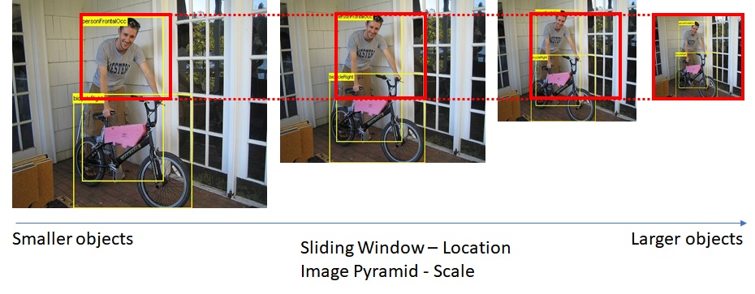

OverFeat: Integrated Recognition, Localization and Detection using Convolutional Networks
=========================================================================================

## Classification, Localization, Detection

OverFeat 논문에서는 다음과 같은 3가지 과업을 동시에 학습시키는 것이 각각의 정확도를 높일 수 있다고 주장한다. 그럼 OverFeat을 자세히 알아보기전에 다음의 3가지 과업에 대해 살펴보자. 사람이 한 명서있는 사진을 머릿속으로 상상해보자. 이에 대해 classification은 이 이미지의 객체가 어떤 것인지 분류하는 것이다. 아마 person으로 분류할 것이다. localization은 classification에 더하여 bounding box라고 하는 것까지 추가해 object가 있는 위치까지 파악하는 것이다. Object Detection은 사진에 사람이 여러 명 존재하거나 고양이, 개와 같은 물체도 함께 있는 사진에서 모든 객체에 대해서 classification과 localization을 수행하는 것이다. 먼저 Detection을 하기 위한 방법을 살펴보자. 만약에 객체가 여러 개 있는 그림을 상상해보자. 만약 2개의 객체가 있더라면 이미지를 crop해서 객체 하나씩 네트워크에 입력 할 수 있지만 앞의 경우에는 몇 개의 객체가 어디에 있는지 알 수 없다. 따라서 고안된 방법이 Sliding Window 이다.

## Sliding Window

입력 이미지에 대해서 Window를 옮겨 가면서 모든 장소에 대해 Localization을 수행하는 것이다. 이때 Localization은 이 영역에 객체가 존재하는지의 여부를 판단하게 되고 만약 존재한다면 bbox를 계산할 것이다. 이런 방식을 사용하면 계산되는 모든 영역에 대하여 localization network와 preprocessing을 공유할 수 있다. 하지만 이 방식은 문제점이 있다. 정해진 크기의 Window를 통해 이미지의 bbox를 추정하는 것은 서로 다른 크기의 객체를 담기에 불충분하다는 것이다. 그래서 고안된 방식이 Image Pyramid를 만드는 것이다. 

## Image Pyramid

총 두개의 방법이 있다. 앞의 Sliding Window 방식에서 Window의 크기를 다르게 하거나(1) Window의 크기를 유지한체 이미지의 크기를 조절하는 방법이다(2). 실험적으로 두 번째 방법이 더 좋다는 것이 입증되었다.

오른쪽으로 갈수록 스케일이 작아지는 형태이다. 빨간색의 동일한 Window 영역을 주의깊게 살펴보자. 오른쪽으로 갈수록 빨간색이 그림에서 담을 수 있는 영역이 넓어지는 것을 볼 수 있다. 따라서 더 큰 객체들을 탐지할 수 있게 되는 것이다. 이러한 식으로 Image Pyramid를 구성하면 그림에서 다양한 크기의 객체를 검출할 수 있다. 하지만 이도 문제점이 존재한다. 너무 많은 input 값이 존재한다는 것이다. 예를 들어 800 x 800 이미지 일 떄 window 의 사이즈가 224이라면 총 331,776개의 crop이미지가 생긴다. 따라서 너무 많은 이미지들이 존재하므로 수 많은 CNN을 계산해내야 한다. 

