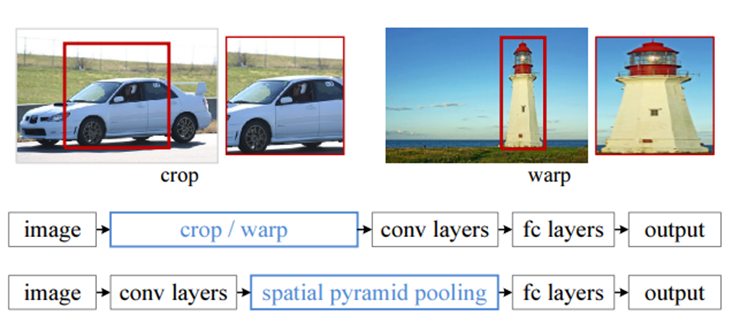
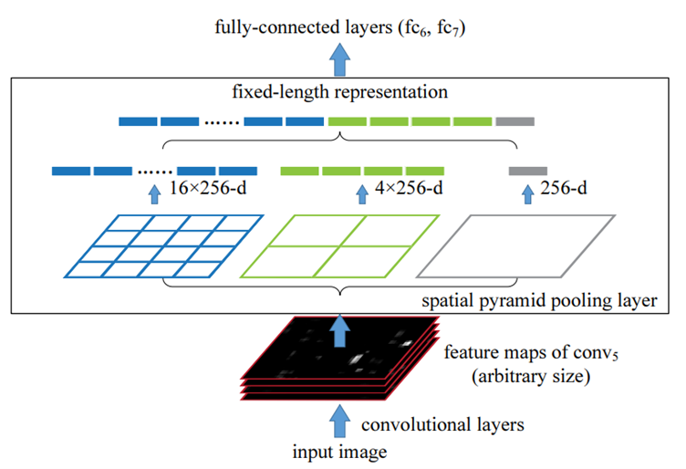

Spatial Pyramid Pooling in Deep Convolutional Networks for Visual Recognition
=================================================================

이 논문에서 아마 가장 중요한 것은 spatial pyramid pooling layer 인 것 같다. 기존에 존재하는 CNN 모델들은 224 x 224와 같은 고정된 크기의 input 이미지를 입력 받아야했다. 왜냐하면 convolution 연산에서는 문제가 되지 않지만 뒤의 fc 레이어 때문에 문제가 된다. 입력층의 노드 수가 정확하게 정해져 있기 때문이다. 그래서 항상 임의적인 크기로 input 이미지를 crop하거나 warp 해주어야 했다. 이는 확실히 기본 이미지를 손실하는 것이기 때문에 줄어든 이미지에 대해서 recognition accuracy 가 떨어질 수 있다. 게다가 여러 이미지의 스케일을 정해두는 것도 적절하지 않다. 따라서 논문 저자들은 이러한 제약조견(반드시 input 이미지의 크기가 고정되야 한다는 점)을 해결하기 위해서 새로운 pooling 전략을 소개했다. 그것이 바로 이 논문의 핵심 쟁점인 SPP이다. 이를 사용하면 fixed feature vector를 입력 이미지의 크기에 상관없이 계산할 수 있다. 이는 object detection 분야에서도 훌륭한 역할을 하는데 SPP-Net을 사용한다면 R-CNN이 각각의 region proposals을 conv network에 pass시키는 것을 개선하여 입력 이미지 하나를 conv network에 한번 통과시킨다. 이는 훨씬 더 간단한 복잡도를 요구하고 그에 따라 비용도 줄어들며 속도도 개선 가능하다.

이들은 conv network 와 문제가 되는 fc layer 사이에 SPP를 두어 이미지 크기에 자유롭게 하였다. 이 레이어는 이름 그대로 pooling의 한 종류이기 때문에 두드러진 특징을 골라주고 정해진 fixed feature vector를 구해준다. 논문에서는 crop과 warping을 대신하기 위해 정보를 aggregation(응축)한다고 나와있다. 전체적으로 봤을 때 이미지의 크기를 줄여야 하는데 컴퓨터비전 적인 알고리즘을 적용하거나 pooling을 사용하면 되는데 이는 pooling의 특별한 연산인 셈이다.
Bag-of-Words 모델의 연장선상에 있는 기술이다. 이는 이미지를 높은 수준의 feature 에서부터 자잘한 수준의 feature로 나누어서(다양한 division의 피라미드를 사용하여) feature들을 합치는 것이다. 이렇게 다양한 multi-level로 pooling 하는 것은 이미지 변형에 매우 robust 해질 수 있다. 또한 이는 트레이닝에서도 다양한 사이즈의 이미지를 학습시킬 수 있기 때문에 scale invariance 와 과적합을 방지할 수 있다.

## Spatial Pyramid Pooling Layer

앞에서 말했듯이 classifier와 fc 레이어는 고정된 크기의 입력 이미지를 받는다. 이를 위해서 SPP를 적용하는데 local spatial bins 를 사용하여 공간적인 정보를 유지한다. SPP의 구조는 다음과 같다. 먼저 conv network를 통해 얻은 feature maps 들에 여려 개의 층으로 구성된 피라미드를 적용해준다. 여기의 예에서는 총 3개의 레벨이다. 첫번째 층(파란색)의 모습을 살펴보자. 여기서는 총 4 x 4로 16개의 칸으로 나누었다. 이 한 칸을 bin이라고 하는데 여기서 등분하는 값은 사용자 지정 값이다. 그래서 이 16 x 16 커널? 을 이용해 각각의 bin에서 max pooling을 적용해준다. 그리고 나온 것 값들을 feature vector로 만들어 주고 각각의 층에서 나온 vector들을 concat 해준다. 한가지 재밌는 사실은 가장 왼쪽에 있는 층은 bin이 하나이기 때문에 global pooling을 하는 것과 같은 효과를 준다. 

## SPP-Net For Object Detection

앞에서 살펴보았듯이 R-CNN 같은 경우는 입력 이미지에서 selective search를 통해 2000개의 region proposals을 추출하고 이 영역의 크기를 조절해준다. 그 후 2000개의 영역을 각각 하나씩 conv network에 pass한다. 이를 개선하여 SPP-Net에서는 마찬가지로 처음에 2000개의 region proposals을 구한다. 하지만 여기서 전체 이미지를 conv network에 통과시켜준다. 그 후에 나온 feature map의 region proposals에 대해서 SPP를 적용해준다. Conv network forward propagation이 이전 방법에 비해 현저히 줄어들어 더 효율 적인 알고리즘이 되었다. 또한 BoW 개념을 사용하기 때문에 작은 여러 개의 특징들을 추출할 수 있게 되었다. 

